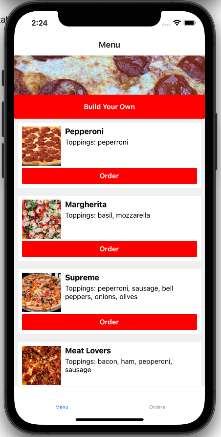
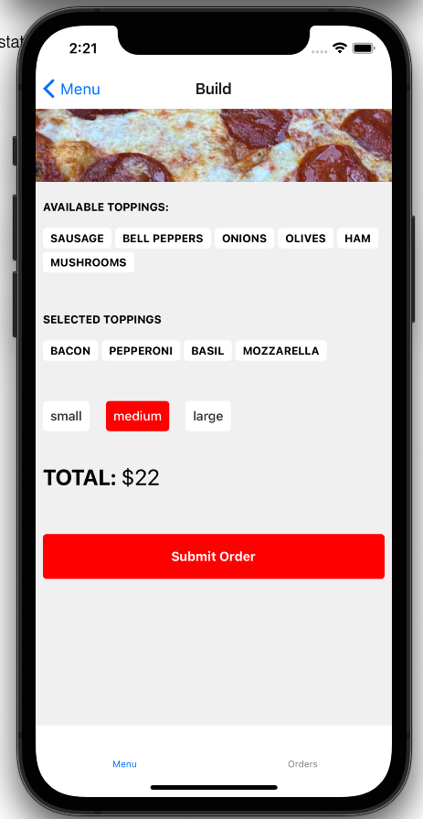
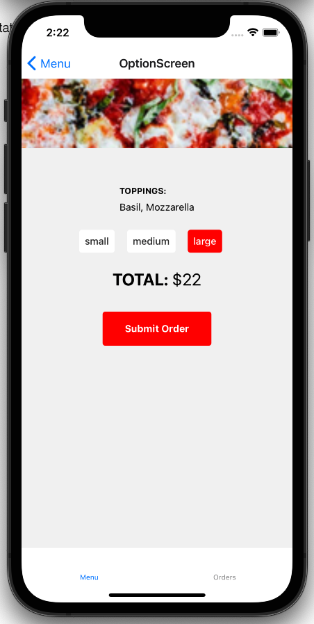
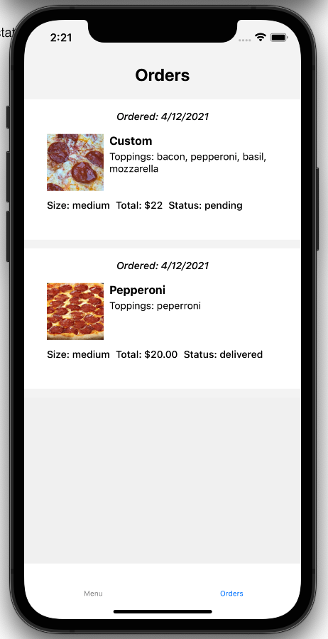

# React Native E2E Testing with Detox

Learn how to setup your local or CI environment to run E2E tests on iOS & Android emulators with Detox. Write E2E tests for a demo application covering best practices and gotchas along the way.

## Table of contents

- [Setup](#setup)
- [Running](#running)
- [Branches](#branches)
- [App Overview](#app-overview)
- [E2E Test Cases](#e2e-test-cases)
- [Resources](#resources)

## Setup

```bash
git clone https://github.com/danecando/JSM-Detox-Testing.git
cd JSMarathon
yarn
```

### Install pods for iOS development

```bash
cd ios && pod install && cd ..
```

## Running

### Android

```
yarn android
```

### iOS

```
yarn ios
```

## Branches

- `main` - Base demo app without detox or e2e tests
- `tests` - Demo app with working e2e tests

## App Overview

We love pizza at This Dot! The demo is an app for our fictional pizza restaurant.

There are two tabs: **Menu and Orders**

The menu tab is a list of the available pizzas to order. You can also build your own pizza using the first button at the top of the screen.



### Build your own

On this screen you can add and remove toppings from your pizza, select the size, see the total price, and submit your order.



### Menu item options

After selecting an item from the menu list you will be taken to a screen that lets you pick the size and see the final price before submitting your order.



### Orders

Orders comes with one previously delivered order populated by default. Any pizzas you create or order will be added to your order screen.



## E2E Test Cases

We want to write e2e tests to cover these user flows

- [ ] User can navigate to orders to see previous orders
- [ ] User can pick an item from the menu, select a size and options, and place an order
- [ ] User can create their own pizza and order it

## Resources

- [https://github.com/wix/Detox](https://github.com/wix/Detox)
- [https://medium.com/wix-engineering/detox-writing-stable-test-suites-372c9d537184](https://medium.com/wix-engineering/detox-writing-stable-test-suites-372c9d537184)
